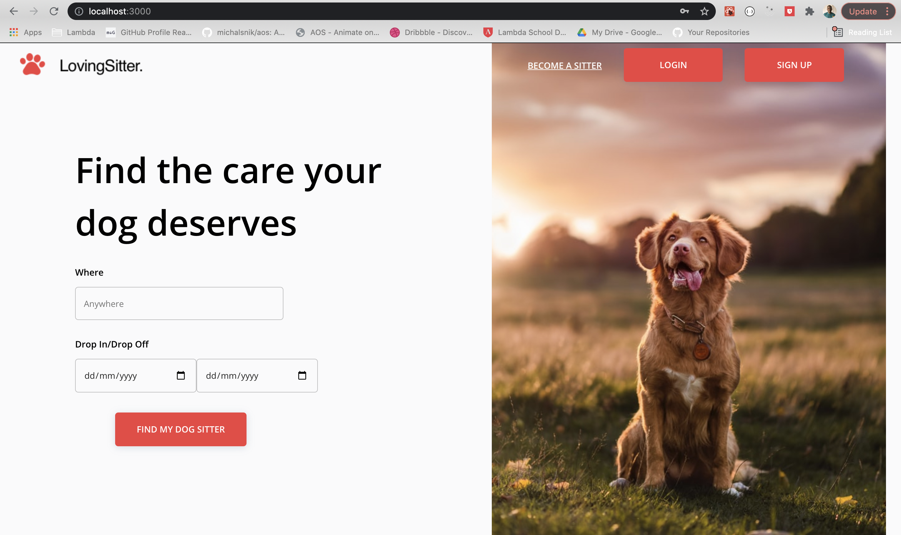
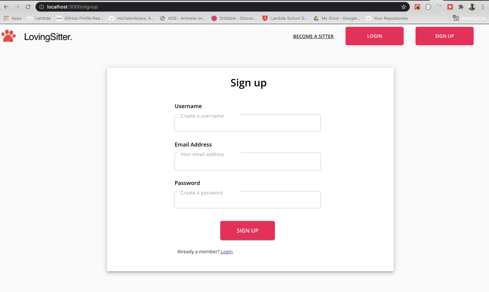
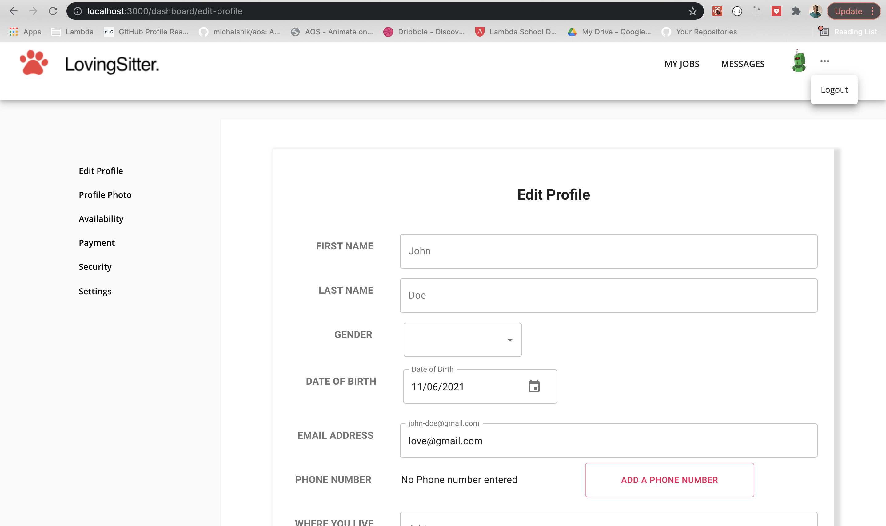
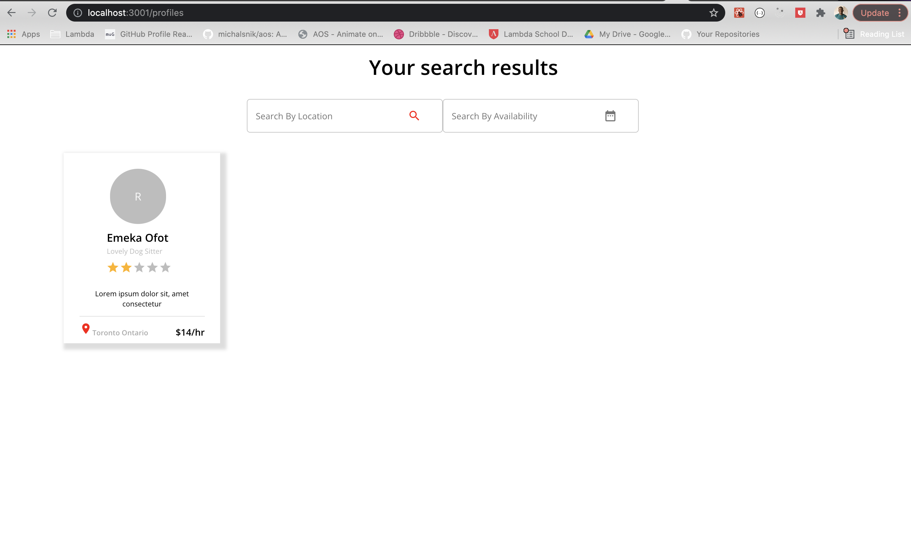
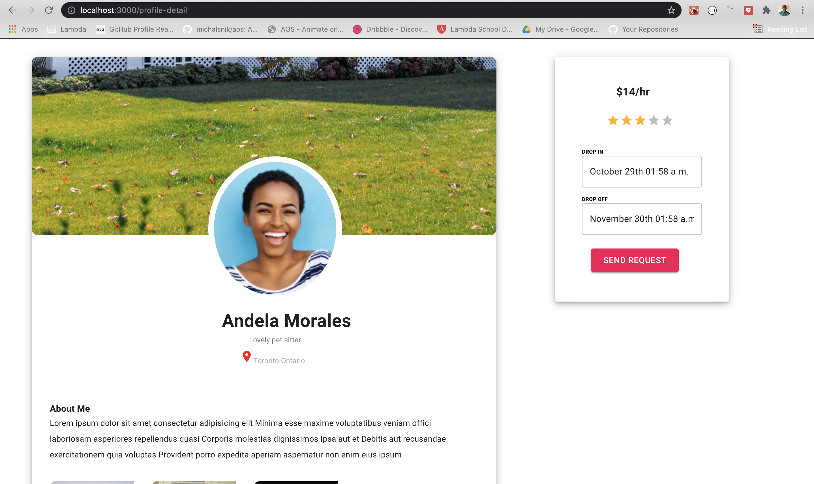
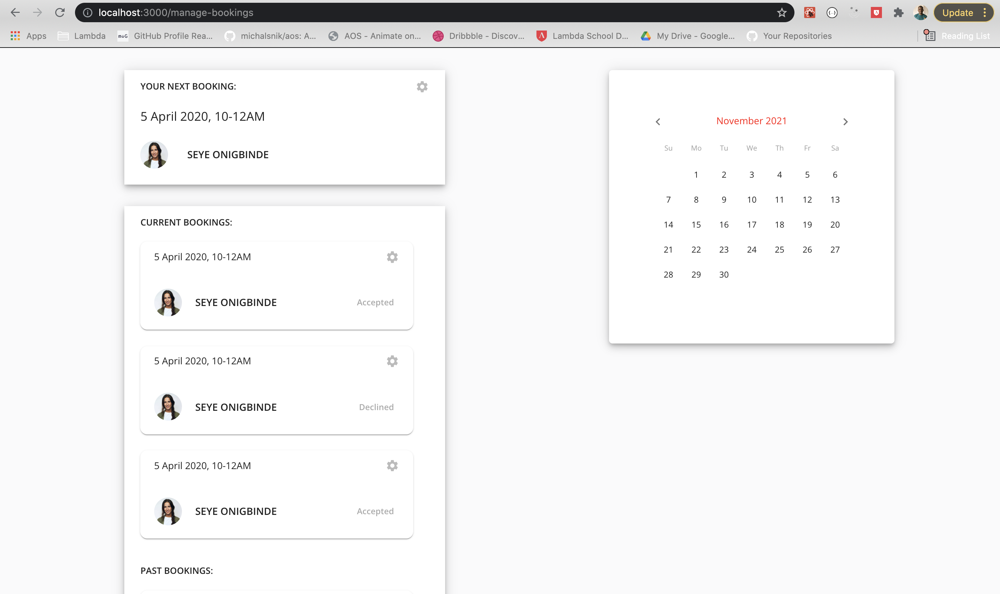

## LovingSitter

LovingSitter is a web application that makes it easier for dog owners to find a dog sitter-- especially in real-time. The goal is to create a beautiful, easy-to-use website that helps dog owners find dog sitters when they need it most. We want dog owners to feel secure, comfortable and at ease with their decision to book a dog sitter. We want dog sitters to feel excited to meet and care for a new dog.

**Tech Stack:** 

- MongoDB 
- Express.js
- React.js 
- Node.js
- Typescript

**Contributors**:

[Seye Onigbinde](https://github.com/seyeonigbinde), [Alen George](https://github.com/Zorba11), [James Cervantes](https://github.com/jamescervantes831) and [Rajiv Titus](https://github.com/rajivtitus)

---

## Server

1. Go into the server directory `cd server`
2. Run `npm install` to install packages
3. Create your environment variable (.env) file
4. Run `npm run dev` to start the server
5. The server will run on [http://localhost:3001](http://localhost:3001)

---

## Client

1. Go into the client directory `cd client`
2. Run `npm install` to install packages
3. Run `npm start` to start the client side
4. Head to [http://localhost:3000](http://localhost:3000) on the browser

---

### Feature Description

1. Homepage. Users will be able to find a dog sitter based on their location and availability

2. Registration. Users will be able to create a new account using their username, email and password

3. Dashboard. Here is a description about what a user can expect to see on their dashboard

4. Profile List. Users will be able to view the list of all dog sitters with their location, ratings and price

5. Profile Detail. Users will be able to click on any Profile Card and view the full detail of the sitter. They can also request for their service

6. Manage Bookings. Users will be able to view the number of bookings that they have both past and current.

